# Autonomous Aerospace Simulator

<p align="center">
  
</p>

<p align="center">
  <a href="https://github.com/gabriel-lab-ia/autonomous-aerospace-simulator/actions/workflows/ci.yml">
    
  </a>
  
  
  
  
  
  
  
</p>

A portfolio-grade aerospace simulation platform for rocket landing dynamics,
autonomous control experiments, secure API execution, and SQL-backed telemetry.

## Core Objective

Build an extensible simulator where increasingly capable controllers can be evaluated under explicit physical constraints.

The current implementation models deterministic vertical motion using gravity, mass, upward thrust, fuel consumption, and Euler integration. The state representation is 3D-ready, but rotational dynamics, aerodynamics, gimbal control, PID, reinforcement learning, and deployment infrastructure are future work.

## Current Capabilities

- vertical rocket dynamics represented with 3D vectors
- gravity, variable mass, throttle, thrust, and fuel consumption
- fixed-throttle experiments
- landing outcome evaluation
- heuristic landing controllers V1 and V2
- optional experimental neural controller integrated through the controller contract
- reusable YAML scenario construction and standardized telemetry
- CSV telemetry, 2D/3D PNG plots, and Markdown reports
- reproducible Python environment managed with `uv`
- automated pytest validation with GitHub Actions
- secure FastAPI service with SQL-backed simulation telemetry
- API key authentication with bounded request schemas
- SQLite local persistence and PostgreSQL-ready configuration

## Technical Stack

- Python 3.11
- NumPy
- Matplotlib
- Pandas
- YAML configs
- FastAPI and Pydantic
- SQLAlchemy with SQLite and optional PostgreSQL
- Pytest and GitHub Actions

PyTorch is an optional dependency used for supervised neural-controller
pretraining and experimental inference. Container-orchestration deployment
services remain planned.

## Secure API And SQL Telemetry Layer

The project includes a FastAPI service with API key authentication and a
SQLAlchemy-backed telemetry store. SQLite supports local development by
default, while `DATABASE_URL` keeps the persistence layer ready for PostgreSQL.

```bash
uv sync --group dev
cp .env.example .env
uv run python scripts/run_api.py
```

- Public health endpoint: `GET /health`
- Protected simulation execution: `POST /simulations/*`
- Protected metadata and telemetry queries: `GET /simulations` and `GET /telemetry/{id}`
- [API architecture, security, and curl examples](docs/api.md)

## Engineering Architecture

The project keeps scenario construction, physical integration, control,
telemetry, visualization, and reporting independently testable.

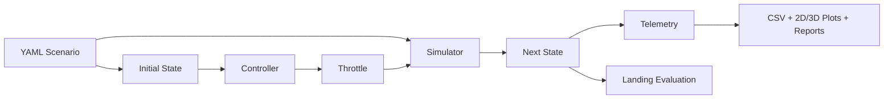

- [Current Architecture](docs/diagrams/current_architecture.md)
- [Verification Pipeline](docs/diagrams/verification_pipeline.md)
- [Configuration And Telemetry Contracts](docs/configuration_and_telemetry.md)

## Quick Start

```bash
uv sync
uv run python scripts/run_basic_simulation.py
uv run pytest -q
```

`uv sync` installs the package editable. For a manually managed environment,
scripts can also be run explicitly with:

```bash
PYTHONPATH=src python scripts/run_basic_simulation.py
```

See [Reproducibility](docs/reproducibility.md) for all experiment and report-generation commands.

## State Vector

- position: x, y, z
- velocity: vx, vy, vz
- orientation: roll, pitch, yaw
- angular velocity: angular_vx, angular_vy, angular_vz
- fuel mass

## Action Vector

- throttle

Gimbal commands are reserved for a future rotational-dynamics model.

## Roadmap

1. Implement and benchmark a classical PID landing controller
2. Compare fixed throttle, Heuristic V1, Heuristic V2, and PID
3. Add precise ground-contact interpolation and stronger physics validation
4. Add a Dockerfile and Docker Compose stack with API and PostgreSQL
5. Build a telemetry visualization dashboard
6. Expose the landing task as a reinforcement learning environment
7. Extend neural-controller evaluation toward simulator-in-the-loop learning
8. Prepare a future Kubernetes deployment

## Current Limitations

The simulator is intentionally minimal and should not be treated as a high-fidelity aerospace model. It currently has no real rotational dynamics, aerodynamics, wind, gimbal actuation, or precise collision-time interpolation.

See [Current Simulator Limitations](docs/limitations.md) for the complete scope and engineering implications.

## Deep Neural Rocket Controller

The optional neural layer provides supervised neural-controller pretraining on
synthetic telemetry and experimental inference through the real simulator
loop. This is a foundation for future simulator-in-the-loop reinforcement
learning, not high-fidelity aerospace validation.

### Parameter Metrics

| Metric | Value |
| --- | ---: |
| Total trainable parameters | 586,630 |

- [Deep Neural Controller Documentation](docs/neural_controller.md)
- [Neural Controller Training Report](docs/results/neural_controller_training_report.md)
- [Controller Comparison](docs/results/controller_comparison.md)

## Initial Results

The first physics validation experiment compares three throttle levels: `0.0`, `0.5`, and `1.0`.

The results show coherent vertical dynamics:

- With zero throttle, the rocket accelerates downward under gravity.
- With half throttle, descent is reduced.
- With full throttle, thrust exceeds weight and vertical velocity becomes positive.

Detailed report:

- [Throttle Comparison Report](docs/results/throttle_comparison.md)
- [Software Engineering Flow](docs/diagrams/software_engineering_flow.md)
- [Physics and Control Loop](docs/diagrams/physics_control_loop.md)

## Numerical Validation Matrices

The automated tests validate the contracts behind the numerical state and
transition matrices. The generated report explains every value and can be
regenerated from the default YAML scenario.

### Initial State Vector (13 x 1)

| Index range | Components | Default values |
|---|---|---|
| 0-2 | position `(x, y, z)` m | `(0, 0, 100)` |
| 3-5 | velocity `(vx, vy, vz)` m/s | `(0, 0, -10)` |
| 6-8 | orientation `(roll, pitch, yaw)` rad | `(0, 0, 0)` |
| 9-11 | angular velocity `(x, y, z)` rad/s | `(0, 0, 0)` |
| 12 | fuel mass kg | `800` |

### One-Step Transition Matrix (`dt = 0.02 s`)

| Throttle | Next altitude (m) | Next vertical velocity (m/s) | Next fuel mass (kg) |
|---:|---:|---:|---:|
| 0.0 | 99.796077 | -10.196133 | 800.000 |
| 0.5 | 99.799577 | -10.021133 | 799.975 |
| 1.0 | 99.803077 | -9.846133 | 799.950 |

The rows share the same initial state. Increasing throttle raises net
acceleration and fuel consumption; gravity remains active in every row.

- [Complete Numerical Validation Report](docs/results/numerical_validation.md)
- [Initial State Vector CSV](docs/results/initial_state_vector.csv)
- [One-Step Transition Matrix CSV](docs/results/one_step_transition_matrix.csv)

## Results Preview

All curated report plots use a reproducible high-contrast dark visual style
implemented in `aerospace_sim.visualization`.

### Final Altitude by Throttle Level

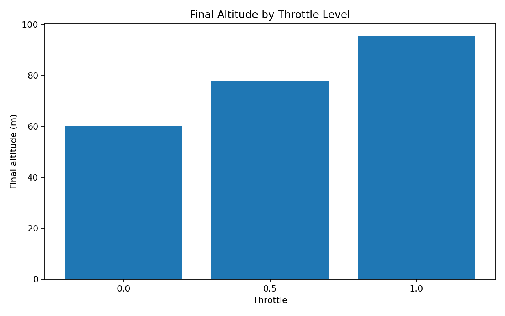

### Final Vertical Velocity by Throttle Level

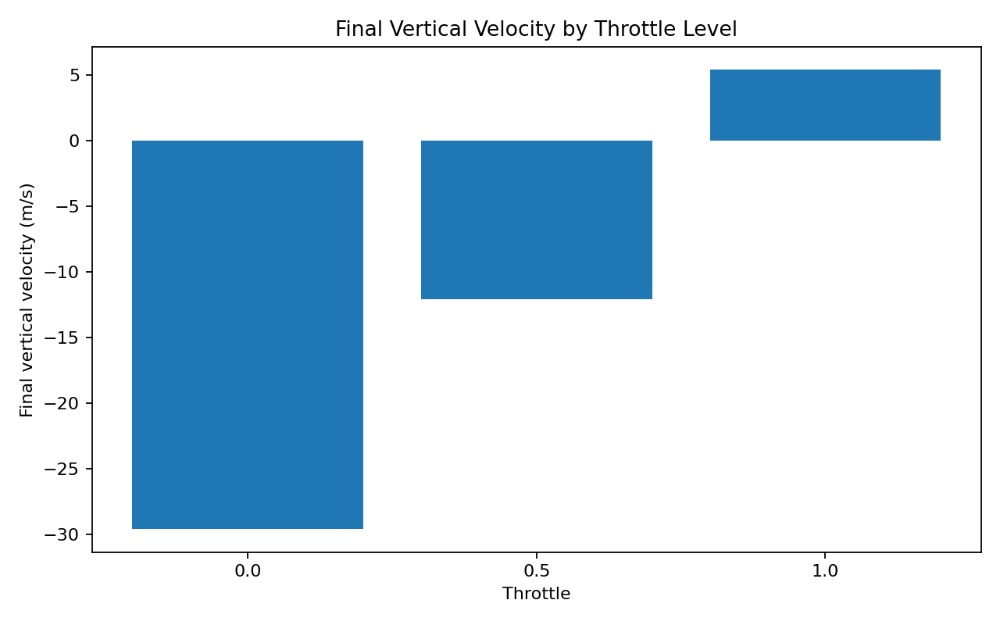

## Trajectory Time-Series Report

The simulator also records full time-series trajectories for altitude, vertical velocity, and fuel mass.

- [Trajectory Report](docs/results/trajectory_report.md)
- [Trajectory Time-Series CSV](docs/results/trajectory_timeseries.csv)

### Altitude Over Time

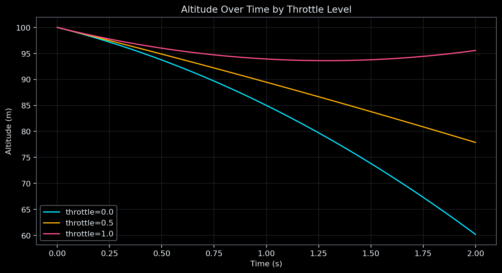

### Vertical Velocity Over Time

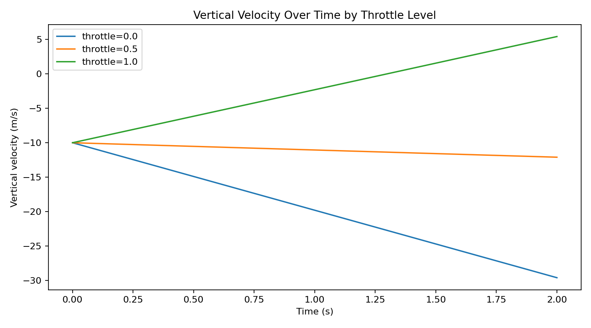

### Fuel Mass Over Time

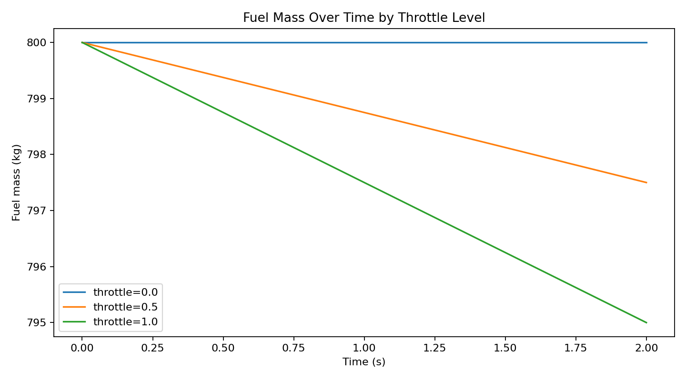

### Fixed-Throttle 3D Phase Space

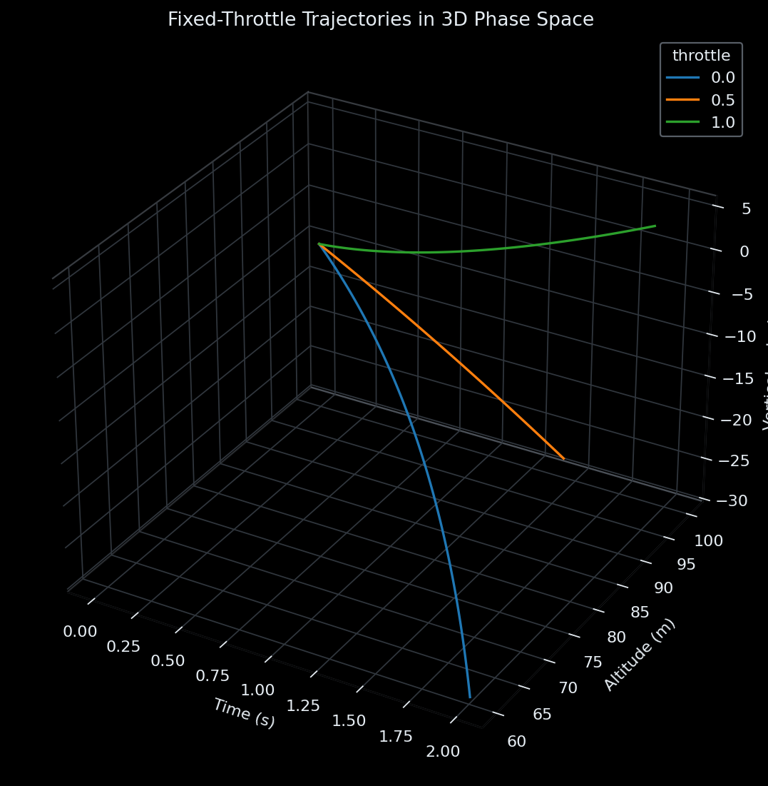

This R3 visualization uses time, altitude, and vertical velocity. It does not
claim lateral motion that the current vertical model does not simulate.

## Landing Evaluation

The simulator now evaluates fixed-throttle landing attempts as `landed`, `crashed`, or `still_flying`.

This experiment shows that fixed throttle cannot solve the landing task by itself: low throttle crashes, while high throttle causes the rocket to keep flying upward.

- [Landing Evaluation Report](docs/results/landing_experiment.md)

### Landing Status by Throttle

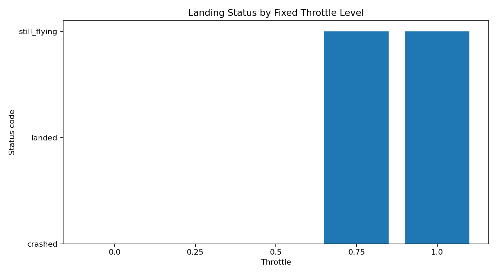

### Final Vertical Velocity by Throttle

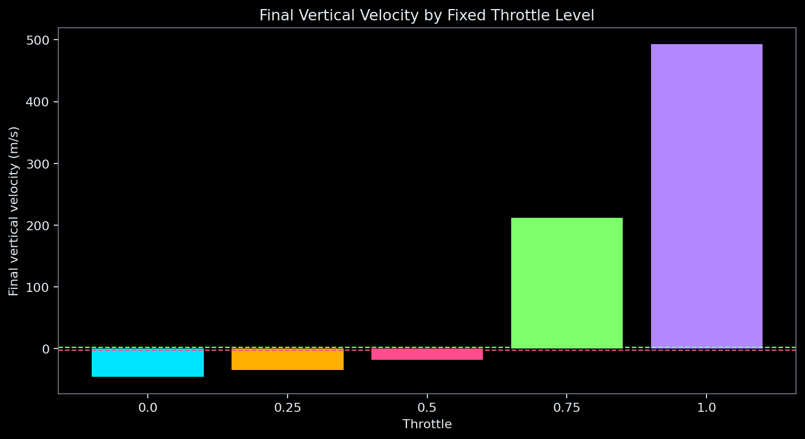

### Fixed-Throttle 3D Landing Outcomes

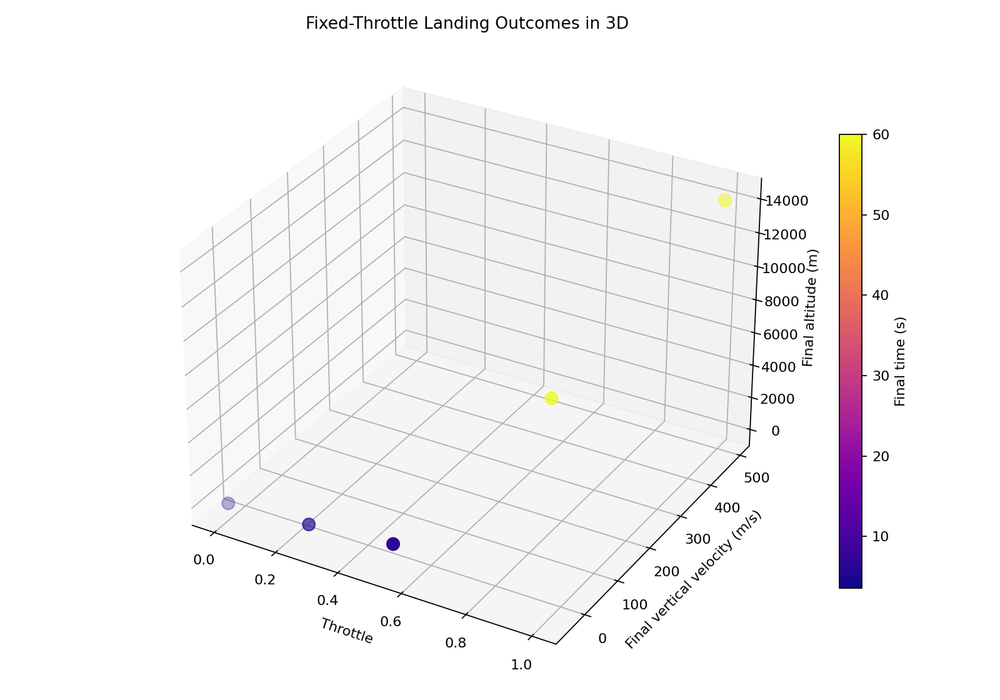

## Heuristic Landing Controller V2

The second heuristic landing controller was tested as a dynamic state-based control policy.

The result shows a runaway ascent failure mode: the controller becomes too aggressive, keeps throttle near maximum, and drives the rocket far above the landing zone.

This failed-control experiment is documented because it motivates the next step: PID control and smoother throttle regulation.

- [Heuristic Controller V2 Report](docs/results/heuristic_v2_report.md)
- [Heuristic Controller V2 Telemetry](docs/results/heuristic_v2_telemetry.csv)

### Heuristic V2 Altitude Over Time

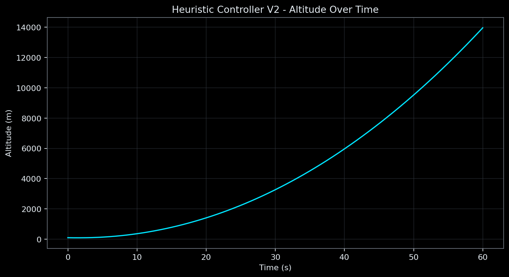

### Heuristic V2 Throttle Over Time

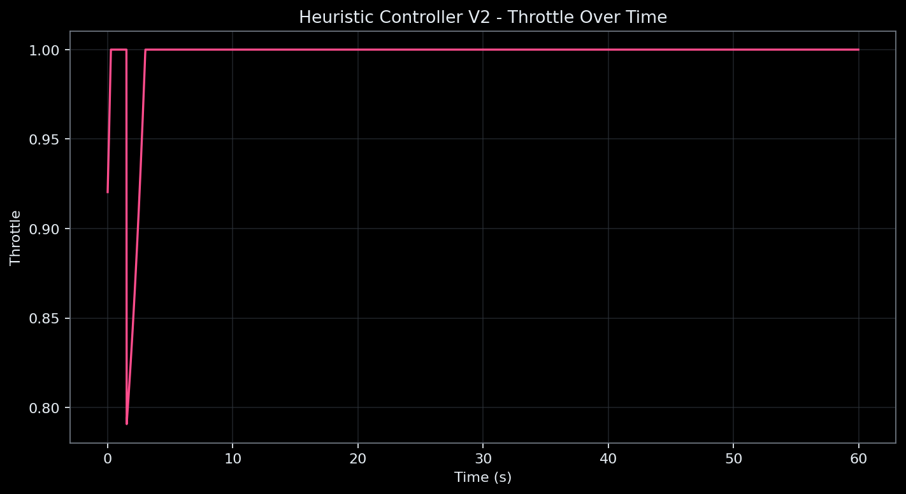

### Heuristic V2 3D Controller State

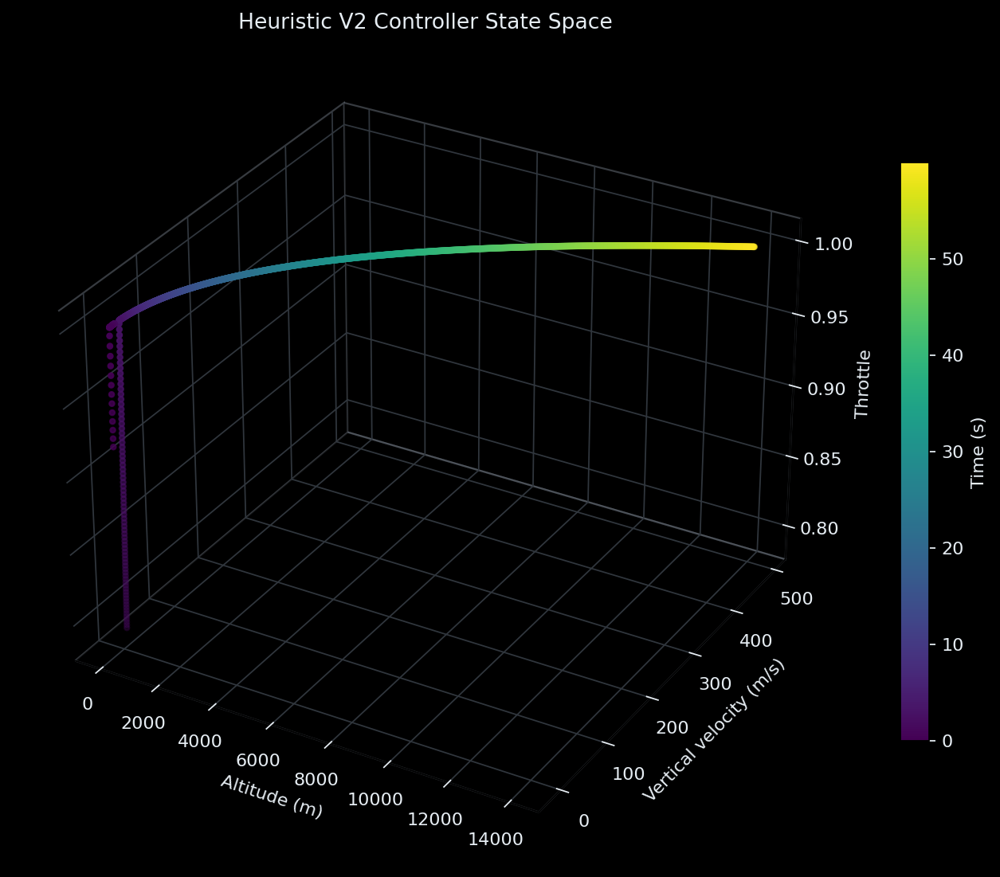

## Results Policy

Curated, small, reproducible reports and plots are versioned in `docs/results/` so GitHub visitors can inspect the project without running it first. Raw telemetry, checkpoints, databases, and temporary experiment outputs belong in `outputs/`, which is ignored by Git.
