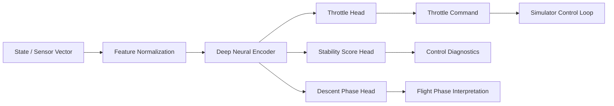
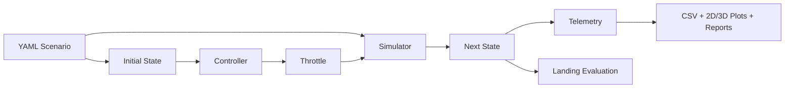

# Autonomous Aerospace System

<p align="center">
  
</p>

<p align="center">
  <a href="https://github.com/gabriel-lab-ia/autonomous-aerospace-simulator/actions/workflows/ci.yml">
    
  </a>
  
  
  
  
  
  
  
</p>

A portfolio-grade aerospace simulation platform for simplified landing dynamics, autonomous control experiments, secure API execution, SQL-backed telemetry, and optional deep neural controller pretraining.

## Core Objective

Build an extensible simulator where increasingly capable controllers can be evaluated under explicit physical constraints.

The current implementation models deterministic vertical motion using gravity, mass, upward thrust, fuel consumption, and Euler integration. The state representation is 3D-ready, but full rotational dynamics, aerodynamics, gimbal control, PID control, reinforcement learning, and deployment infrastructure remain future work.

## Current Capabilities

- vertical vehicle dynamics represented with 3D vectors
- gravity, variable mass, throttle, thrust, and fuel consumption
- fixed-throttle experiments
- landing outcome evaluation
- heuristic landing controllers V1 and V2
- optional PyTorch deep neural controller for landing-control pretraining
- neural throttle prediction from 13D aerospace state/sensor vectors
- multi-head network for throttle, stability estimation, and descent-phase classification
- supervised neural-controller training script with CUDA detection
- pytest contracts for neural model shapes, bounds, dataset generation, and inference
- reusable YAML scenario construction and standardized telemetry
- CSV telemetry, 2D/3D PNG plots, and Markdown reports
- reproducible Python environment managed with `uv`
- automated pytest validation with GitHub Actions
- secure FastAPI service with SQL-backed simulation telemetry
- API key authentication with bounded request schemas
- SQLite local persistence and PostgreSQL-ready configuration

## Technical Stack

- Python 3.11
- NumPy
- Matplotlib
- Pandas
- YAML configs
- FastAPI and Pydantic
- SQLAlchemy with SQLite and optional PostgreSQL
- PyTorch for optional neural-controller training
- Pytest and GitHub Actions

PyTorch-based neural-controller training is available as an optional ML module. CUDA is automatically used when available. Container-orchestration deployment services remain planned future work.

## Deep Neural Rocket Controller

The project includes an optional PyTorch-based deep learning layer for landing-control experiments.

This module adapts a dense multi-head perceptron architecture to the aerospace domain. Instead of learning from quantum statevectors, the neural controller learns from state/sensor telemetry and predicts bounded control signals for simplified landing dynamics.

The current neural controller is implemented as a supervised pretraining stage. It is not yet a closed-loop reinforcement learning controller inside the simulator runtime, but it provides the tested foundation for future simulator-in-the-loop neural control and RL experiments.

- [Deep Neural Controller Documentation](docs/neural_controller.md)
- Source: `src/aerospace_sim/learning/neural_controller.py`
- Training script: `scripts/train_neural_controller.py`
- Tests: `tests/test_neural_controller.py`

### Neural Control Objective

The neural network learns a control-oriented representation of the state and predicts:

| Output head | Task | Output |
|---|---|---|
| `throttle_head` | Continuous control command | Bounded throttle in `[0, 1]` |
| `stability_head` | Control-quality estimation | Stability score in `[0, 1]` |
| `phase_head` | Descent-phase recognition | 4-class classification logits |

The descent-phase classes are `terminal_descent`, `powered_descent`, `approach`, and `high_altitude`.

### Neural Input Vector

The model consumes the simulator's 13-dimensional aerospace state vector:

| Index | Feature | Unit |
|---:|---|---|
| 0 | position_x_m | m |
| 1 | position_y_m | m |
| 2 | altitude_z_m | m |
| 3 | velocity_x_mps | m/s |
| 4 | velocity_y_mps | m/s |
| 5 | vertical_velocity_z_mps | m/s |
| 6 | roll_rad | rad |
| 7 | pitch_rad | rad |
| 8 | yaw_rad | rad |
| 9 | angular_velocity_x_radps | rad/s |
| 10 | angular_velocity_y_radps | rad/s |
| 11 | angular_velocity_z_radps | rad/s |
| 12 | fuel_mass_kg | kg |

Before entering the neural network, raw values are normalized using fixed engineering-scale constants. This keeps altitude, velocity, attitude, angular velocity, and fuel mass in numerically stable ranges.

### Deep Learning Architecture

```text
Input: 13 aerospace state/sensor features

Encoder:
Linear(13 -> 512)
LayerNorm(512)
GELU
Dropout(0.05)

Linear(512 -> 512)
LayerNorm(512)
GELU
Dropout(0.05)

Linear(512 -> 256)
LayerNorm(256)
GELU

Linear(256 -> 256)
LayerNorm(256)
GELU
```

The shared latent representation is passed to three output heads:

```text
Throttle Head:
Linear(256 -> 128)
LayerNorm(128)
GELU
Linear(128 -> 64)
GELU
Linear(64 -> 1)
Sigmoid

Stability Head:
Linear(256 -> 128)
LayerNorm(128)
GELU
Linear(128 -> 64)
GELU
Linear(64 -> 1)
Sigmoid

Phase Head:
Linear(256 -> 128)
LayerNorm(128)
GELU
Linear(128 -> 4)
Softmax used during evaluation
```

### Parameter Metrics

| Metric | Value |
|---|---:|
| Input features | 13 |
| Hidden width | 512 |
| Latent dimension | 256 |
| Output heads | 3 |
| Phase classes | 4 |
| Total trainable parameters | ~745k |


This gives the project a non-trivial deep learning component while keeping the architecture compact enough for local experimentation on CPU or CUDA-enabled GPUs.

### Training Strategy

The first training stage uses supervised pretraining on synthetic aerospace state/sensor samples.

A deterministic teacher policy generates target throttle commands from altitude, vertical descent speed, remaining fuel mass, and simplified landing-risk heuristics. The teacher is intentionally conservative: faster downward velocity increases throttle demand, lower altitude increases throttle demand, very low fuel reduces throttle aggressiveness, and near-ground throttle is capped to avoid unrealistic runaway ascent in the simplified vertical simulator.

The model is optimized with a multi-task loss:

```text
loss = throttle_mse + stability_mse + 0.25 * phase_cross_entropy
```

This trains the network to jointly learn continuous throttle imitation, approximate landing-control stability estimation, and descent-phase classification from sensor state.

### Training Command

The neural controller is part of the optional ML dependency group:

```bash
uv sync --group ml
uv run python scripts/train_neural_controller.py
```

The training script automatically selects CUDA when available:

```text
Device: cuda  # if a CUDA-compatible GPU is available
Device: cpu   # otherwise
```

Generated training artifacts are written to:

```text
outputs/neural_controller/models/neural_rocket_controller.pt
outputs/neural_controller/figures/neural_controller_loss.png
outputs/neural_controller/figures/neural_controller_metrics.png
```

These outputs are intentionally ignored by Git. Curated plots and reports can later be promoted to `docs/results/` once benchmarked against the fixed, heuristic, PID, and future reinforcement-learning controllers.

### Validation Metrics Tracked During Training

| Metric | Meaning |
|---|---|
| `train_loss` | Total multi-task training loss |
| `val_loss` | Total multi-task validation loss |
| `val_throttle_mae` | Mean absolute error of predicted throttle |
| `val_stability_mae` | Mean absolute error of predicted stability score |
| `val_phase_accuracy` | Accuracy of descent-phase classification |

These metrics are saved into the model checkpoint and plotted as PNG figures.

### Test Coverage

The neural controller includes automated pytest coverage for:

- forward-pass tensor shapes;
- throttle output bounded in `[0, 1]`;
- stability output bounded in `[0, 1]`;
- softmax phase probabilities summing to `1`;
- synthetic dataset shape and value contracts;
- teacher-policy behavior under safer vs. riskier descent states;
- feature-normalization contract;
- single-state inference contract;
- parameter-count reporting.

The tests use:

```python
pytest.importorskip("torch")
```

This keeps the base CI lightweight and prevents the core simulator tests from failing when the optional ML dependency group is not installed.

### How The Neural Controller Fits Into The Project

The current simulator already supports deterministic dynamics, state-based control experiments, telemetry generation, SQL-backed API execution, plots, and Markdown reports.

The neural controller extends this architecture with a machine-learning control layer:



This design prepares the project for future controller comparisons:

| Controller | Status |
|---|---|
| Fixed throttle | Implemented |
| Heuristic V1 | Implemented |
| Heuristic V2 | Implemented |
| PID controller | Planned |
| Neural supervised controller | Initial module implemented |
| Reinforcement learning controller | Future work |

### Current Neural Controller Limitations

The neural controller is currently a supervised pretraining module. It does not yet run as the active closed-loop controller inside the simulator by default.

The current simulator is intentionally minimal and should not be treated as a high-fidelity aerospace model. It currently focuses on simplified vertical dynamics and does not yet include full aerodynamics, wind, gimbal actuation, high-fidelity rotational dynamics, or precise collision-time interpolation.

The next engineering steps are:

1. connect neural-controller inference directly to the simulator control loop;
2. compare neural throttle against fixed-throttle and heuristic controllers;
3. add a PID baseline for classical control comparison;
4. generate curated neural-controller plots under `docs/results/`;
5. expose the landing task as a reinforcement-learning environment;
6. evolve from supervised imitation learning to simulator-in-the-loop RL.

## Secure API And SQL Telemetry Layer

The project includes a FastAPI service with API key authentication and a SQLAlchemy-backed telemetry store. SQLite supports local development by default, while `DATABASE_URL` keeps the persistence layer ready for PostgreSQL.

```bash
uv sync --group dev
cp .env.example .env
uv run python scripts/run_api.py
```

- Public health endpoint: `GET /health`
- Protected simulation execution: `POST /simulations/*`
- Protected metadata and telemetry queries: `GET /simulations` and `GET /telemetry/{id}`
- [API architecture, security, and curl examples](docs/api.md)

## Engineering Architecture

The project keeps scenario construction, physical integration, control, telemetry, visualization, and reporting independently testable.



- [Current Architecture](docs/diagrams/current_architecture.md)
- [Verification Pipeline](docs/diagrams/verification_pipeline.md)
- [Configuration And Telemetry Contracts](docs/configuration_and_telemetry.md)

## Quick Start

```bash
uv sync
uv run python scripts/run_basic_simulation.py
uv run pytest -q
```

For a manually managed environment:

```bash
PYTHONPATH=src python scripts/run_basic_simulation.py
```

See [Reproducibility](docs/reproducibility.md) for all experiment and report-generation commands.

## State Vector

- position: x, y, z
- velocity: vx, vy, vz
- orientation: roll, pitch, yaw
- angular velocity: angular_vx, angular_vy, angular_vz
- fuel mass

## Action Vector

- throttle

Gimbal commands are reserved for a future rotational-dynamics model.

## Roadmap

1. Implement and benchmark a classical PID landing controller
2. Compare fixed throttle, Heuristic V1, Heuristic V2, and PID
3. Add precise ground-contact interpolation and stronger physics validation
4. Add Docker and Docker Compose support for API and SQL services
5. Build a telemetry visualization dashboard
6. Expose the landing task as a reinforcement learning environment
7. Integrate neural-controller inference into the simulation control loop
8. Add neural-controller benchmarking and experiment tracking
9. Prepare a future Kubernetes deployment

## Current Limitations

The simulator is intentionally minimal and should not be treated as a high-fidelity aerospace model. It currently has no real rotational dynamics, aerodynamics, wind, gimbal actuation, or precise collision-time interpolation.

See [Current Simulator Limitations](docs/limitations.md) for the complete scope and engineering implications.

## Initial Results

The first physics validation experiment compares three throttle levels: `0.0`, `0.5`, and `1.0`.

- With zero throttle, the vehicle accelerates downward under gravity.
- With half throttle, descent is reduced.
- With full throttle, thrust exceeds weight and vertical velocity becomes positive.

Detailed report:

- [Throttle Comparison Report](docs/results/throttle_comparison.md)
- [Software Engineering Flow](docs/diagrams/software_engineering_flow.md)
- [Physics and Control Loop](docs/diagrams/physics_control_loop.md)

## Numerical Validation Matrices

The automated tests validate the contracts behind the numerical state and transition matrices.

### Initial State Vector (13 x 1)

| Index range | Components | Default values |
|---|---|---|
| 0-2 | position `(x, y, z)` m | `(0, 0, 100)` |
| 3-5 | velocity `(vx, vy, vz)` m/s | `(0, 0, -10)` |
| 6-8 | orientation `(roll, pitch, yaw)` rad | `(0, 0, 0)` |
| 9-11 | angular velocity `(x, y, z)` rad/s | `(0, 0, 0)` |
| 12 | fuel mass kg | `800` |

### One-Step Transition Matrix (`dt = 0.02 s`)

| Throttle | Next altitude (m) | Next vertical velocity (m/s) | Next fuel mass (kg) |
|---:|---:|---:|---:|
| 0.0 | 99.796077 | -10.196133 | 800.000 |
| 0.5 | 99.799577 | -10.021133 | 799.975 |
| 1.0 | 99.803077 | -9.846133 | 799.950 |

- [Complete Numerical Validation Report](docs/results/numerical_validation.md)
- [Initial State Vector CSV](docs/results/initial_state_vector.csv)
- [One-Step Transition Matrix CSV](docs/results/one_step_transition_matrix.csv)

## Results Preview

All curated report plots use a reproducible high-contrast dark visual style implemented in `aerospace_sim.visualization`.

### Final Altitude by Throttle Level


### Final Vertical Velocity by Throttle Level


## Trajectory Time-Series Report

The simulator records full time-series trajectories for altitude, vertical velocity, and fuel mass.

- [Trajectory Report](docs/results/trajectory_report.md)
- [Trajectory Time-Series CSV](docs/results/trajectory_timeseries.csv)

### Altitude Over Time


### Vertical Velocity Over Time


### Fuel Mass Over Time


### Fixed-Throttle 3D Phase Space


This R3 visualization uses time, altitude, and vertical velocity. It does not claim lateral motion that the current vertical model does not simulate.

## Landing Evaluation

The simulator evaluates fixed-throttle landing attempts as `landed`, `crashed`, or `still_flying`.

This experiment shows that fixed throttle cannot solve the landing task by itself: low throttle crashes, while high throttle causes continued upward flight.

- [Landing Evaluation Report](docs/results/landing_experiment.md)

### Landing Status by Throttle


### Final Vertical Velocity by Throttle


### Fixed-Throttle 3D Landing Outcomes


## Heuristic Landing Controller V2

The second heuristic landing controller was tested as a dynamic state-based control policy.

The result shows a runaway ascent failure mode: the controller becomes too aggressive, keeps throttle near maximum, and drives the vehicle far above the landing zone.

This failed-control experiment is documented because it motivates the next step: PID control and smoother throttle regulation.

- [Heuristic Controller V2 Report](docs/results/heuristic_v2_report.md)
- [Heuristic Controller V2 Telemetry](docs/results/heuristic_v2_telemetry.csv)

### Heuristic V2 Altitude Over Time


### Heuristic V2 Throttle Over Time


### Heuristic V2 3D Controller State


## Results Policy

Curated, small, reproducible reports and plots are versioned in `docs/results/` so GitHub visitors can inspect the project without running it first. Raw telemetry, checkpoints, databases, and temporary experiment outputs belong in `outputs/`, which is ignored by Git.
