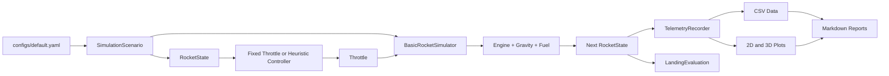

# Current Architecture

```mermaid
flowchart LR
    YAML[configs/default.yaml] --> SC[SimulationScenario]
    SC --> STATE[RocketState]
    SC --> SIM[BasicRocketSimulator]
    CTRL[Fixed Throttle or Heuristic Controller] --> ACTION[Throttle]
    STATE --> CTRL
    ACTION --> SIM
    SIM --> PHYS[Engine + Gravity + Fuel]
    PHYS --> NEXT[Next RocketState]
    NEXT --> REC[TelemetryRecorder]
    NEXT --> EVAL[LandingEvaluation]
    REC --> CSV[CSV Data]
    REC --> PLOT[2D and 3D Plots]
    CSV --> REPORT[Markdown Reports]
    PLOT --> REPORT
```

The PID controller will enter through the same controller-to-throttle contract,
without changing scenario construction, physics integration, or telemetry.
