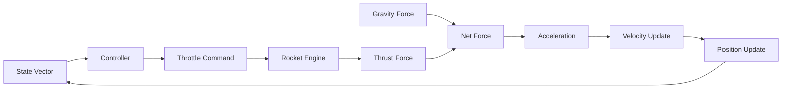

# Physics and Control Loop

```mermaid
flowchart LR
    A[State Vector] --> B[Controller]
    B --> C[Throttle Command]
    C --> D[Rocket Engine]
    D --> E[Thrust Force]
    F[Gravity Force] --> G[Net Force]
    E --> G
    G --> H[Acceleration]
    H --> I[Velocity Update]
    I --> J[Position Update]
    J --> A
```

The current controller action is throttle only. Gimbal, rotational dynamics, aerodynamics, and stochastic disturbances are future work.
