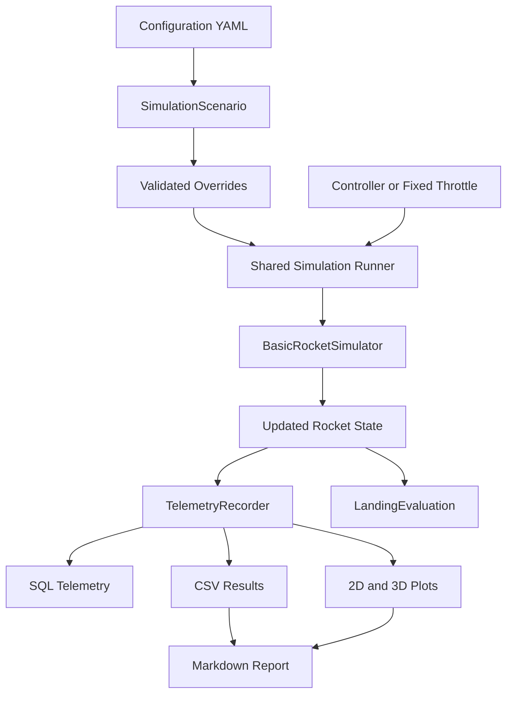

# Software Engineering Flow

```mermaid
flowchart TD
    A[Configuration YAML] --> B[SimulationScenario]
    B --> C[Validated Overrides]
    C --> D[Shared Simulation Runner]
    E[Controller or Fixed Throttle] --> D
    D --> F[BasicRocketSimulator]
    F --> G[Updated Rocket State]
    G --> H[TelemetryRecorder]
    G --> I[LandingEvaluation]
    H --> J[SQL Telemetry]
    H --> K[CSV Results]
    H --> L[2D and 3D Plots]
    K --> M[Markdown Report]
    L --> M
```

API routes and experiment scripts share this flow while scenario, execution,
telemetry, physics, and visualization remain reusable library modules.
