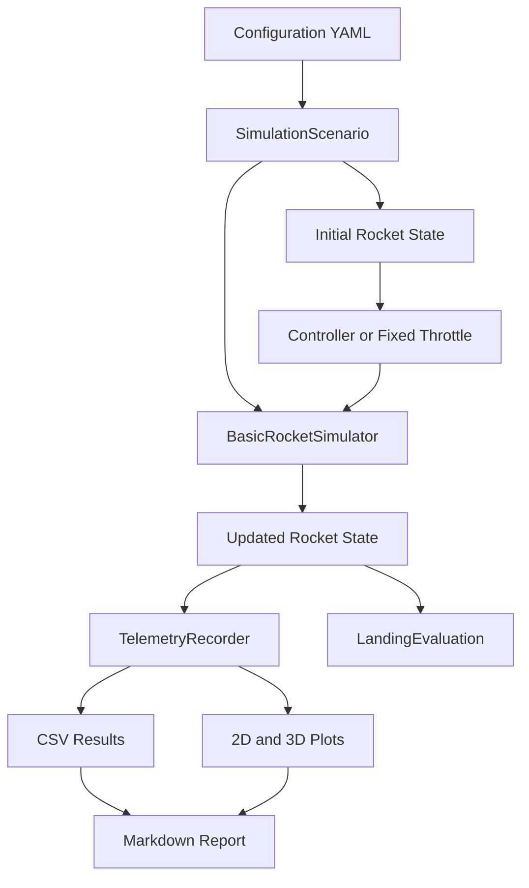

# Software Engineering Flow

```mermaid
flowchart TD
    A[Configuration YAML] --> B[SimulationScenario]
    B --> C[Initial Rocket State]
    B --> D[BasicRocketSimulator]
    C --> E[Controller or Fixed Throttle]
    E --> D
    D --> F[Updated Rocket State]
    F --> G[TelemetryRecorder]
    F --> H[LandingEvaluation]
    G --> I[CSV Results]
    G --> J[2D and 3D Plots]
    I --> K[Markdown Report]
    J --> K
```

Experiment scripts coordinate this flow while scenario, telemetry, physics, and visualization remain reusable library modules.
