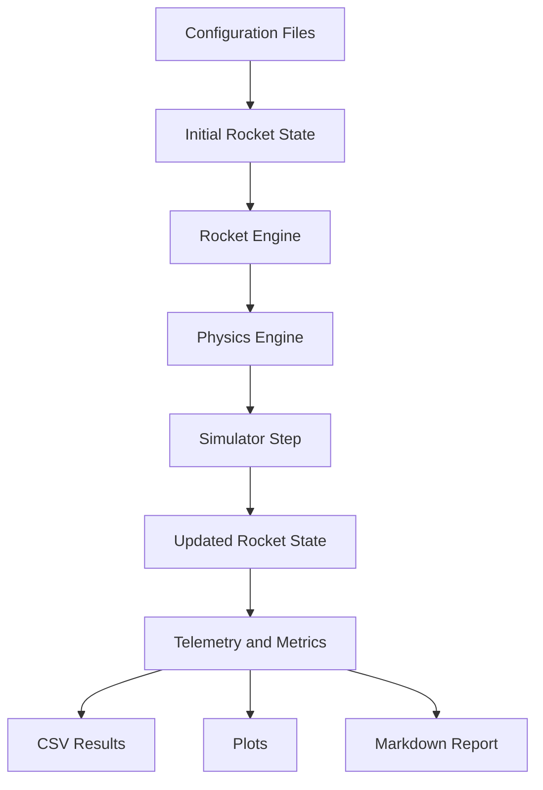

# Software Engineering Flow

```mermaid
flowchart TD
    A[Configuration Files] --> B[Initial Rocket State]
    B --> C[Rocket Engine]
    C --> D[Physics Engine]
    D --> E[Simulator Step]
    E --> F[Updated Rocket State]
    F --> G[Telemetry and Metrics]
    G --> H[CSV Results]
    G --> I[Plots]
    G --> J[Markdown Report]
```

The current experiment scripts coordinate this flow. Reusable telemetry and visualization modules are planned but not implemented yet.
