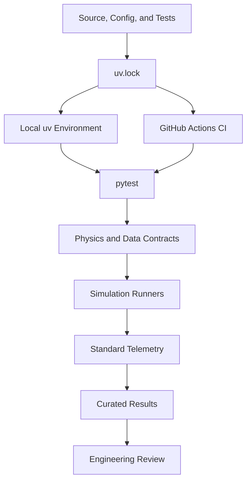

# Verification Pipeline

```mermaid
flowchart TD
    CODE[Source, Config, and Tests] --> LOCK[uv.lock]
    LOCK --> LOCAL[Local uv Environment]
    LOCK --> CI[GitHub Actions CI]
    LOCAL --> PYTEST[pytest]
    CI --> PYTEST
    PYTEST --> CONTRACTS[Physics and Data Contracts]
    CONTRACTS --> RUNNERS[Simulation Runners]
    RUNNERS --> TELEMETRY[Standard Telemetry]
    TELEMETRY --> RESULTS[Curated Results]
    RESULTS --> REVIEW[Engineering Review]
```

The lockfile keeps local and CI dependency resolution aligned. Curated results
remain reviewable artifacts; raw outputs stay outside Git.
