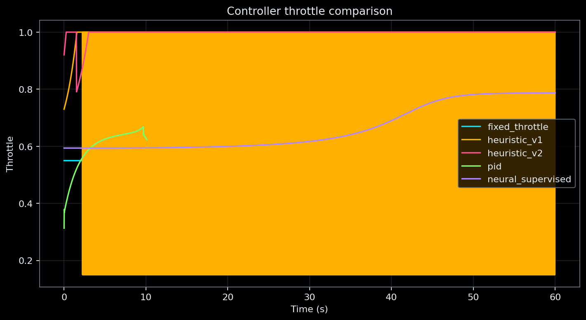
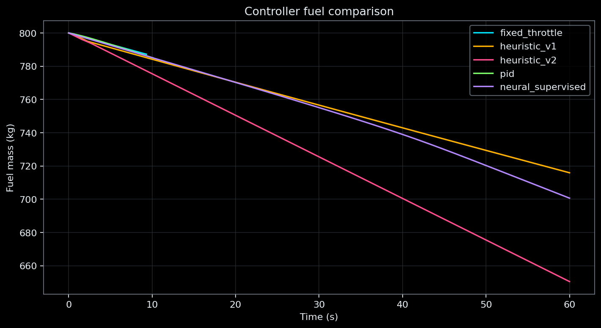

# Controller Trajectory Comparison

This benchmark compares controller behavior inside the current simplified
vertical simulator. These results are useful for software and control-system
regression testing, but they do not represent high-fidelity aerospace validation.

## Scenario

- Initial altitude: `100.0 m`
- Initial vertical velocity: `-10.0 m/s`
- Time step: `0.020 s`
- Maximum simulated time: `60.0 s`
- Ground contact stops each trajectory

## Real Benchmark Metrics

| controller        |   final_altitude_m |   final_vertical_velocity_m_s |   final_fuel_mass_kg |   min_altitude_m |   max_altitude_m |   flight_time_s | landing_status   |   touchdown_speed_m_s |   throttle_mean |   throttle_max |   throttle_saturation_fraction | controller_notes                                                   |
|:------------------|-------------------:|------------------------------:|---------------------:|-----------------:|-----------------:|----------------:|:-----------------|----------------------:|----------------:|---------------:|-------------------------------:|:-------------------------------------------------------------------|
| fixed_throttle    |             0.0000 |                      -11.4050 |             787.1850 |           0.0000 |         100.0000 |          9.3200 | crashed          |               11.4050 |          0.5500 |         0.5500 |                         0.0000 | Open-loop fixed throttle baseline.                                 |
| heuristic_v1      |           263.6417 |                        3.0571 |             715.8963 |          89.2274 |         263.6417 |         60.0000 | still_flying     |              nan      |          0.5608 |         1.0000 |                         0.4625 | Manual rule-based baseline V1.                                     |
| heuristic_v2      |         13974.0973 |                      489.5257 |             650.4656 |          93.3661 |       13974.0973 |         60.0000 | still_flying     |              nan      |          0.9969 |         1.0000 |                         0.9720 | Manual rule-based baseline V2 with known ascent failure mode.      |
| pid               |             0.0000 |                       -3.4798 |             784.9199 |           0.0000 |         100.0000 |         10.1400 | crashed          |                3.4798 |          0.5949 |         0.6689 |                         0.0000 | Classical feedback baseline; gains are not optimized.              |
| neural_supervised |          1739.5862 |                      115.0260 |             700.6346 |          20.6143 |        1739.5862 |         60.0000 | still_flying     |              nan      |          0.6625 |         0.7869 |                         0.0000 | Experimental supervised controller using the available checkpoint. |

## Comparative Plots

## Interpretation

- Fixed throttle is an open-loop baseline.
- Heuristic V1 and V2 are manually designed rule-based controllers.
- PID is a classical feedback baseline with untuned gains.
- Neural control is experimental and supervised. It uses a local checkpoint
  when available; otherwise a deterministic untrained network is explicitly labeled.
- Reinforcement learning is future work and was not executed in this benchmark.
- A `landed` classification only satisfies the simplified simulator threshold.
  It is not evidence of real aerospace landing capability.

## Artifacts

- `outputs/controller_benchmark/controller_comparison.csv`
- `outputs/controller_benchmark/controller_comparison.json`
- `outputs/controller_benchmark/trajectories/<controller_name>.csv`

## Limitations

The simulator omits aerodynamics, rotation, wind, actuator dynamics, sensor
noise, ground-contact interpolation, and real flight data. Metrics therefore
measure behavior only within this deterministic vertical model.
