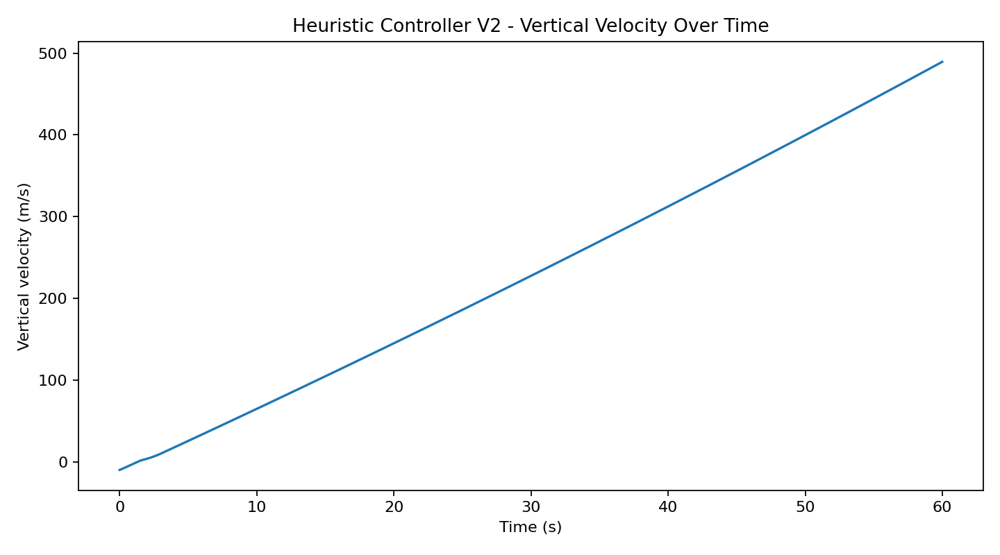
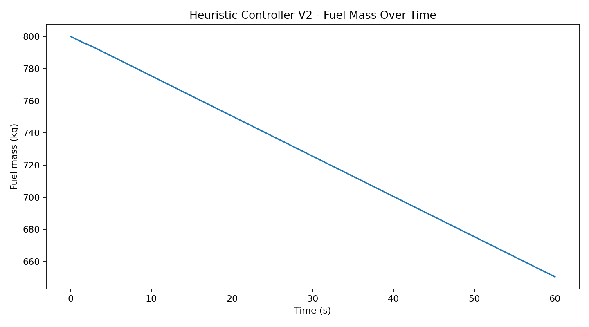

# Heuristic Landing Controller V2 Experiment

This experiment evaluates the second heuristic landing controller.

The controller is dynamic: it reads the rocket state at each simulation step and adjusts throttle based on altitude and vertical velocity.

## Final Result

| status       |   final_altitude_m |   final_velocity_z_m_s |   final_speed_m_s |   final_time_s |   final_fuel_mass_kg |
|:-------------|-------------------:|-----------------------:|------------------:|---------------:|---------------------:|
| still_flying |            13974.1 |                489.526 |           489.526 |             60 |              650.466 |

## Plots

### Altitude Over Time

### Vertical Velocity Over Time

### Throttle Over Time

### Fuel Mass Over Time

## Engineering Interpretation

The V2 heuristic controller does not land the rocket.

Instead, it becomes too aggressive and keeps throttle near maximum for too long. This causes a runaway ascent: the rocket keeps accelerating upward and ends the simulation far above the landing zone.

This is an important failed-control result.

It shows that avoiding crash is not enough. A valid landing controller must also regulate ascent, descent rate, and throttle smoothness near the landing zone.

## Next Step

The next engineering step is to move from heuristic control to a more stable controller:

- tune the heuristic controller with softer throttle corrections
- introduce a PID controller
- penalize upward velocity and excessive altitude gain
- eventually train a reinforcement learning policy using the simulator telemetry
