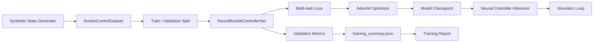

# Training Pipeline

This document describes the current training and evaluation pipeline for the
optional neural controller in the Autonomous Aerospace System project.

The neural controller is an experimental supervised-learning module. It is not
a high-fidelity aerospace controller and has not solved autonomous landing. Its
purpose is to provide a tested foundation for future simulator-in-the-loop
control and reinforcement learning experiments.

## Pipeline Overview



## Data Source

The first training stage uses synthetic aerospace state/sensor samples.

Each sample contains the 13-dimensional simulator state vector:

| Feature group | Components |
|---|---|
| Position | `x`, `y`, `z` |
| Velocity | `vx`, `vy`, `vz` |
| Orientation | `roll`, `pitch`, `yaw` |
| Angular velocity | `angular_vx`, `angular_vy`, `angular_vz` |
| Fuel | `fuel_mass` |

The synthetic dataset is generated by `RocketControlDataset`.

## Training Targets

The training pipeline uses three targets:

| Target | Type | Meaning |
|---|---|---|
| Throttle | Regression | Bounded throttle command in `[0, 1]` |
| Stability score | Regression | Approximate control-quality score in `[0, 1]` |
| Descent phase | Classification | Coarse phase of descent |

The teacher policy is deterministic and heuristic-based. It uses altitude,
vertical velocity, and fuel mass to generate conservative throttle targets.

## Model

The model is implemented as:

```text
NeuralRocketControllerNet
```

It contains:

- dense encoder layers;
- `LayerNorm`;
- `GELU`;
- `Dropout`;
- throttle regression head;
- stability regression head;
- descent-phase classification head.

The default model has:

```text
586,630 trainable parameters
```

## Loss Function

The training objective is a multi-task loss:

```text
loss = throttle_mse + stability_mse + 0.25 * phase_cross_entropy
```

This encourages the network to jointly learn:

1. throttle imitation;
2. approximate stability estimation;
3. descent-phase recognition.

## Training Command

Install the optional ML dependency group and run:

```bash
uv sync --group ml
uv run python scripts/train_neural_controller.py
```

The script automatically selects CUDA when available.

## Generated Artifacts

Training outputs are written to:

```text
outputs/neural_controller/
```

Expected generated files include:

```text
outputs/neural_controller/models/neural_rocket_controller.pt
outputs/neural_controller/figures/neural_controller_loss.png
outputs/neural_controller/figures/neural_controller_metrics.png
outputs/neural_controller/training_summary.json
```

The `outputs/` directory is intentionally ignored by Git.

## Published Report

A curated training report is stored in:

```text
docs/results/neural_controller_training_report.md
```

The report must use real metrics from a completed training run. Do not invent or
manually fabricate performance numbers.

## Current CPU Training Snapshot

The current documented training run used:

| Metric | Value |
|---|---:|
| Epochs | 6 |
| Samples | 4,096 |
| Validation loss | 0.0298154 |
| Throttle MAE | 0.0249123 |
| Stability MAE | 0.0431861 |
| Phase accuracy | 95.6098% |

These metrics describe supervised learning on synthetic telemetry. They do not
prove successful closed-loop landing.

## Simulator Integration

The trained checkpoint can be used by the neural controller integration to
produce bounded throttle inference inside the simulator loop.

The controller output is always clamped to:

```text
0.0 <= throttle <= 1.0
```

If no checkpoint is provided, untrained inference must be treated as
experimental only and must not be reported as a trained policy.

## Controller Comparison

The neural controller should be compared against:

| Controller | Status |
|---|---|
| Fixed throttle | Implemented baseline |
| Heuristic V1 | Implemented rule-based controller |
| Heuristic V2 | Implemented but shows runaway ascent failure mode |
| PID | Planned classical control baseline |
| Neural supervised controller | Experimental supervised module |
| Reinforcement learning | Future work |

## Limitations

The current neural controller:

- is trained on synthetic data;
- is supervised, not reinforcement learning;
- does not yet demonstrate successful landing;
- is not a high-fidelity aerospace controller;
- should be treated as an experimental foundation for future control research.

## Next Steps

1. Improve the teacher policy or train from a stronger controller.
2. Add a PID baseline.
3. Generate trajectory-based imitation datasets.
4. Compare fixed, heuristic, PID, and neural controllers.
5. Add simulator-in-the-loop reinforcement learning.
